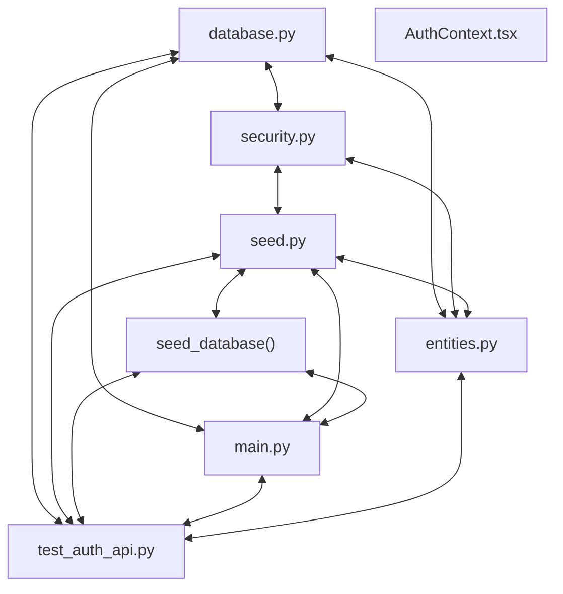

# Codebase Architectural Report

> **Auto-generated** by graphify knowledge graph analysis  
> **Purpose**: Dependency map, connection analysis, subsystem breakdown, and quality hotspots.

---

## 1. Executive Summary

- **Total Components**: `89`
- **Total Connections**: `236`
- **Subsystem Modules**: `14`
- **Dependency Types**: `10`

**Key Architectural Hubs:**

| # | Component | File | Type | Connections |
|---|-----------|------|------|-------------|
| 1 | `database.py` | `backend/app/core/database.py` | file | 19 |
| 2 | `test_auth_api.py` | `backend/tests/test_auth_api.py` | file | 16 |
| 3 | `security.py` | `backend/app/core/security.py` | file | 15 |
| 4 | `entities.py` | `backend/app/models/entities.py` | file | 14 |
| 5 | `seed.py` | `backend/app/core/seed.py` | file | 13 |
| 6 | `seed_database()` | `backend/app/core/seed.py` | method | 13 |
| 7 | `main.py` | `backend/app/main.py` | file | 13 |
| 8 | `AuthContext.tsx` | `frontend/src/auth/AuthContext.tsx` | class | 13 |

---

## 2. Dependency & Connection Analysis

### Relationship Types

| Relationship | Count | Share |
|-------------|-------|-------|
| `imports` | 49 | 21% |
| `rationale_for` | 47 | 20% |
| `contains` | 46 | 19% |
| `imports_from` | 36 | 15% |
| `references` | 25 | 11% |
| `calls` | 19 | 8% |
| `uses` | 6 | 3% |
| `inherits` | 4 | 2% |
| `indirect_call` | 3 | 1% |
| `method` | 1 | 0% |

### Hub Dependency Diagram

### Most Connected Pairs

| Component A | Component B | Shared Connections |
|-------------|-------------|-------------------|
| `Meridian FastAPI application package.` | `app/__init__.py` | 1 |
| `Core configuration, persistence, security, and seeding services.` | `core/__init__.py` | 1 |
| `config.py` | `get_settings()` | 1 |
| `Settings` | `config.py` | 1 |
| `Application configuration loaded from environment variables.` | `config.py` | 1 |
| `config.py` | `database.py` | 1 |
| `config.py` | `security.py` | 1 |
| `config.py` | `main.py` | 1 |
| `config.py` | `test_auth_api.py` | 1 |
| `Settings` | `get_settings()` | 1 |

---

## 3. Subsystem & Module Breakdown

### 3.1 backend
**Nodes**: `17`  
**Files**: `backend/app/core/config.py`, `backend/app/core/database.py`, `backend/app/core/security.py`, `backend/app/main.py`, `backend/app/routers/auth.py`, `backend/app/routers/health.py` +1 more

| Component | Type | File | Connections |
|-----------|------|------|-------------|
| `database.py` | file | `backend/app/core/database.py` | 19 |
| `test_auth_api.py` | file | `backend/tests/test_auth_api.py` | 16 |
| `security.py` | file | `backend/app/core/security.py` | 15 |
| `main.py` | file | `backend/app/main.py` | 13 |
| `routers/auth.py` | file | `backend/app/routers/auth.py` | 11 |
| `get_settings()` | method | `backend/app/core/config.py` | 10 |
| `config.py` | file | `backend/app/core/config.py` | 7 |
| `lifespan()` | method | `backend/app/main.py` | 7 |
| `dispose_engine()` | method | `backend/app/core/database.py` | 6 |
| `FastAPI` | class | `` | 5 |

**External dependencies:** `get_session()` (3), `entities.py` (3), `seed.py` (3), `seed_database()` (3), `create_access_token()` (2)

### 3.2 backend/app
**Nodes**: `14`  
**Files**: `backend/app/core/database.py`, `backend/app/core/security.py`, `backend/app/core/seed.py`, `backend/app/models/entities.py`

| Component | Type | File | Connections |
|-----------|------|------|-------------|
| `entities.py` | file | `backend/app/models/entities.py` | 14 |
| `seed.py` | file | `backend/app/core/seed.py` | 13 |
| `seed_database()` | method | `backend/app/core/seed.py` | 13 |
| `Base` | class | `backend/app/core/database.py` | 10 |
| `Coordinator` | class | `backend/app/models/entities.py` | 9 |
| `Member` | class | `backend/app/models/entities.py` | 7 |
| `CarePlanGoal` | class | `backend/app/models/entities.py` | 6 |
| `CareGap` | class | `backend/app/models/entities.py` | 6 |
| `Outreach` | class | `backend/app/models/entities.py` | 6 |
| `hash_password()` | method | `backend/app/core/security.py` | 4 |

**External dependencies:** `database.py` (8), `security.py` (4), `test_auth_api.py` (4), `main.py` (2), `auth_service.py` (2)

### 3.3 frontend/src
**Nodes**: `23`  
**Files**: `frontend/src/App.tsx`, `frontend/src/api/client.ts`, `frontend/src/auth/AuthContext.tsx`, `frontend/src/main.tsx`, `frontend/src/pages/LoginPage.test.tsx`, `frontend/src/pages/LoginPage.tsx` +1 more

| Component | Type | File | Connections |
|-----------|------|------|-------------|
| `AuthContext.tsx` | class | `frontend/src/auth/AuthContext.tsx` | 13 |
| `App.tsx` | class | `frontend/src/App.tsx` | 9 |
| `client.ts` | file | `frontend/src/api/client.ts` | 6 |
| `useAuth()` | method | `frontend/src/auth/AuthContext.tsx` | 6 |
| `LoginPage.tsx` | class | `frontend/src/pages/LoginPage.tsx` | 6 |
| `AuthProvider()` | class | `frontend/src/auth/AuthContext.tsx` | 5 |
| `LoginPage.test.tsx` | class | `frontend/src/pages/LoginPage.test.tsx` | 5 |
| `types.ts` | file | `frontend/src/types.ts` | 5 |
| `LoginPage()` | class | `frontend/src/pages/LoginPage.tsx` | 4 |
| `loginRequest()` | method | `frontend/src/api/client.ts` | 3 |

### 3.4 backend/app
**Nodes**: `13`  
**Files**: `backend/app/core/security.py`, `backend/app/routers/auth.py`, `backend/app/schemas/auth.py`, `backend/app/services/auth_service.py`

| Component | Type | File | Connections |
|-----------|------|------|-------------|
| `auth_service.py` | file | `backend/app/services/auth_service.py` | 11 |
| `login()` | method | `backend/app/routers/auth.py` | 9 |
| `authenticate_coordinator()` | method | `backend/app/services/auth_service.py` | 8 |
| `LoginResponse` | class | `backend/app/schemas/auth.py` | 7 |
| `create_access_token()` | method | `backend/app/core/security.py` | 5 |
| `schemas/auth.py` | file | `backend/app/schemas/auth.py` | 5 |
| `LoginRequest` | class | `backend/app/schemas/auth.py` | 5 |
| `verify_password()` | method | `backend/app/core/security.py` | 4 |
| `BaseModel` | class | `` | 2 |
| `post` | function | `` | 1 |

**External dependencies:** `routers/auth.py` (6), `security.py` (3), `get_settings()` (1), `get_session()` (1), `Return whether a plaintext password matches its stored bcrypt hash.` (1)

### 3.7 backend/tests/test_auth_api.py
**Nodes**: `6`  
**Files**: `backend/tests/test_auth_api.py`

| Component | Type | File | Connections |
|-----------|------|------|-------------|
| `asyncio` | function | `` | 8 |
| `test_seed_is_idempotent_and_creates_twenty_members()` | method | `backend/tests/test_auth_api.py` | 4 |
| `test_health_reports_process_liveness()` | method | `backend/tests/test_auth_api.py` | 3 |
| `test_login_returns_token_role_and_name_for_seeded_coordinator()` | method | `backend/tests/test_auth_api.py` | 3 |
| `test_login_rejects_bad_credentials()` | method | `backend/tests/test_auth_api.py` | 3 |
| `test_login_token_has_expected_role_payload()` | method | `backend/tests/test_auth_api.py` | 3 |

**External dependencies:** `test_auth_api.py` (5), `security.py` (1), `seed.py` (1), `seed_database()` (1), `auth_service.py` (1)

### 3.8 backend/app/core
**Nodes**: `7`  
**Files**: `backend/app/core/database.py`, `backend/app/core/security.py`

| Component | Type | File | Connections |
|-----------|------|------|-------------|
| `get_current_coordinator()` | method | `backend/app/core/security.py` | 9 |
| `get_session()` | method | `backend/app/core/database.py` | 7 |
| `AsyncSession` | class | `` | 1 |
| `HTTPAuthorizationCredentials` | class | `` | 1 |
| `Depends` | class | `` | 1 |
| `bearer_scheme` | function | `` | 1 |
| `AsyncSession` | class | `` | 1 |

**External dependencies:** `security.py` (2), `get_settings()` (1), `database.py` (1), `Yield an async database session and ensure it closes afterward.` (1), `routers/auth.py` (1)

### 3.9 backend/app/routers/health.py
**Nodes**: `2`  
**Files**: `backend/app/routers/health.py`

| Component | Type | File | Connections |
|-----------|------|------|-------------|
| `health()` | method | `backend/app/routers/health.py` | 3 |
| `get` | function | `` | 1 |

**External dependencies:** `health.py` (1), `Return a stable liveness response without touching dependencies.` (1)

### 3.10 backend/app/core/__init__.py
**Nodes**: `1`  
**Files**: `backend/app/core/__init__.py`

| Component | Type | File | Connections |
|-----------|------|------|-------------|
| `core/__init__.py` | file | `backend/app/core/__init__.py` | 1 |

**External dependencies:** `Core configuration, persistence, security, and seeding services.` (1)

### 3.11 backend/app/__init__.py
**Nodes**: `1`  
**Files**: `backend/app/__init__.py`

| Component | Type | File | Connections |
|-----------|------|------|-------------|
| `app/__init__.py` | file | `backend/app/__init__.py` | 1 |

**External dependencies:** `Meridian FastAPI application package.` (1)

### 3.12 backend/app/models/__init__.py
**Nodes**: `1`  
**Files**: `backend/app/models/__init__.py`

| Component | Type | File | Connections |
|-----------|------|------|-------------|
| `models/__init__.py` | file | `backend/app/models/__init__.py` | 1 |

**External dependencies:** `Database entity package.` (1)

### 3.13 backend/app/schemas/__init__.py
**Nodes**: `1`  
**Files**: `backend/app/schemas/__init__.py`

| Component | Type | File | Connections |
|-----------|------|------|-------------|
| `schemas/__init__.py` | file | `backend/app/schemas/__init__.py` | 1 |

**External dependencies:** `API request and response schema package.` (1)

### 3.14 backend/app/services/__init__.py
**Nodes**: `1`  
**Files**: `backend/app/services/__init__.py`

| Component | Type | File | Connections |
|-----------|------|------|-------------|
| `services/__init__.py` | file | `backend/app/services/__init__.py` | 1 |

**External dependencies:** `Application service package.` (1)

### 3.15 backend/app/routers
**Nodes**: `1`  
**Files**: `backend/app/routers/__init__.py`

| Component | Type | File | Connections |
|-----------|------|------|-------------|
| `routers/__init__.py` | file | `backend/app/routers/__init__.py` | 0 |

### 3.16 frontend/e2e
**Nodes**: `1`  
**Files**: `frontend/e2e/auth.spec.ts`

| Component | Type | File | Connections |
|-----------|------|------|-------------|
| `auth.spec.ts` | file | `frontend/e2e/auth.spec.ts` | 0 |

---

## 4. API Reference

Public classes and functions by subsystem.

### backend

| Name | Type | File | Connections |
|------|------|------|-------------|
| `FastAPI` | class | `` | 5 |
| `Settings` | class | `backend/app/core/config.py` | 4 |
| `BaseSettings` | class | `` | 1 |
| `fixture` | function | `` | 1 |

### backend/app

| Name | Type | File | Connections |
|------|------|------|-------------|
| `Base` | class | `backend/app/core/database.py` | 10 |
| `Coordinator` | class | `backend/app/models/entities.py` | 9 |
| `Member` | class | `backend/app/models/entities.py` | 7 |
| `CarePlanGoal` | class | `backend/app/models/entities.py` | 6 |
| `CareGap` | class | `backend/app/models/entities.py` | 6 |
| `Outreach` | class | `backend/app/models/entities.py` | 6 |
| `AuditLog` | class | `backend/app/models/entities.py` | 4 |
| `DeclarativeBase` | class | `` | 1 |

### frontend/src

| Name | Type | File | Connections |
|------|------|------|-------------|
| `AuthContext.tsx` | class | `frontend/src/auth/AuthContext.tsx` | 13 |
| `App.tsx` | class | `frontend/src/App.tsx` | 9 |
| `LoginPage.tsx` | class | `frontend/src/pages/LoginPage.tsx` | 6 |
| `AuthProvider()` | class | `frontend/src/auth/AuthContext.tsx` | 5 |
| `LoginPage.test.tsx` | class | `frontend/src/pages/LoginPage.test.tsx` | 5 |
| `LoginPage()` | class | `frontend/src/pages/LoginPage.tsx` | 4 |
| `LoginCredentials` | class | `frontend/src/types.ts` | 3 |
| `AuthSession` | class | `frontend/src/types.ts` | 3 |

### backend/app

| Name | Type | File | Connections |
|------|------|------|-------------|
| `LoginResponse` | class | `backend/app/schemas/auth.py` | 7 |
| `LoginRequest` | class | `backend/app/schemas/auth.py` | 5 |
| `BaseModel` | class | `` | 2 |
| `post` | function | `` | 1 |
| `AsyncSession` | class | `` | 1 |
| `Depends` | class | `` | 1 |
| `AsyncSession` | class | `` | 1 |

### backend/tests/test_auth_api.py

| Name | Type | File | Connections |
|------|------|------|-------------|
| `asyncio` | function | `` | 8 |

### backend/app/core

| Name | Type | File | Connections |
|------|------|------|-------------|
| `AsyncSession` | class | `` | 1 |
| `HTTPAuthorizationCredentials` | class | `` | 1 |
| `Depends` | class | `` | 1 |
| `bearer_scheme` | function | `` | 1 |
| `AsyncSession` | class | `` | 1 |

### backend/app/routers/health.py

| Name | Type | File | Connections |
|------|------|------|-------------|
| `get` | function | `` | 1 |

---

## 5. Code Quality & Architectural Risk Hotspots

### Component Type Distribution

| Type | Count | Share |
|------|-------|-------|
| class | 37 | 42% |
| method | 26 | 29% |
| file | 20 | 22% |
| function | 6 | 7% |

### High-Connectivity Hotspots

**2** component(s) with >15 connections:

| Component | File | Connections |
|-----------|------|-------------|
| `database.py` | `backend/app/core/database.py` | 19 |
| `test_auth_api.py` | `backend/tests/test_auth_api.py` | 16 |

### Dependency Cycles

**109** circular dependency loop(s) detected:

| # | Cycle Path |
|---|-----------|
| 1 | `frontend_src_auth_authcontext → frontend_src_types → frontend_src_types_authcontextvalue` |
| 2 | `frontend_src_api_client → frontend_src_types_logincredentials → frontend_src_types` |
| 3 | `frontend_src_auth_authcontext → frontend_src_types_logincredentials → frontend_src_types` |
| 4 | `frontend_src_api_client → frontend_src_types_authsession → frontend_src_types` |
| 5 | `frontend_src_auth_authcontext → frontend_src_types_authsession → frontend_src_types` |
| 6 | `frontend_src_auth_authcontext → frontend_src_api_client → frontend_src_types` |
| 7 | `frontend_src_auth_authcontext → frontend_src_api_client_loginrequest → frontend_src_api_client` |
| 8 | `frontend_src_auth_authcontext → frontend_src_auth_authcontext_authprovider → frontend_src_api_client_loginrequest` |
| 9 | `frontend_src_auth_authcontext → frontend_src_pages_loginpage_test → frontend_src_auth_authcontext_authprovider` |
| 10 | `frontend_src_app → frontend_src_pages_loginpage_loginpage → frontend_src_pages_loginpage_test → frontend_src_auth_authcontext_authprovider` |

### Orphaned Components

**2** isolated node(s) with no connections:

| Component | File |
|-----------|------|
| `routers/__init__.py` | `backend/app/routers/__init__.py` |
| `auth.spec.ts` | `frontend/e2e/auth.spec.ts` |

---

## 6. How to Navigate

1. **Interactive D3 Map** — open `graph.html` to explore node connections visually.
2. **Knowledge Graph Queries** — use MCP tools (`graph_query`, `graph_explain_node`, `graph_impact_radius`).
